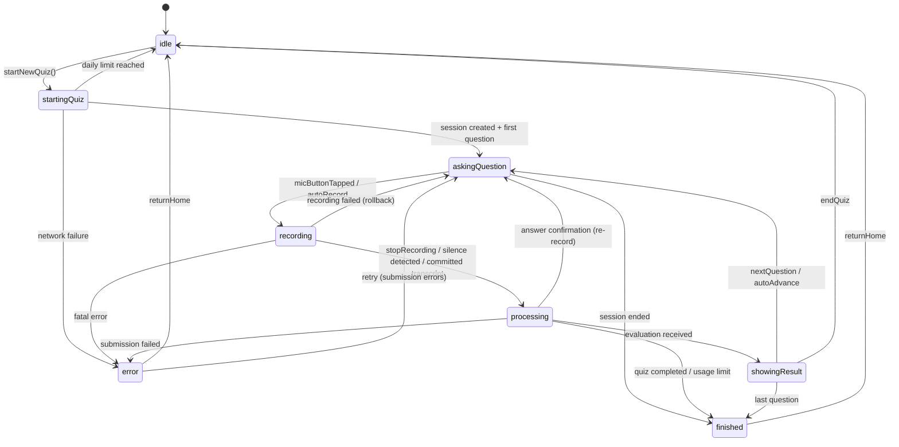

# Architecture & Workflow Research Report

**Issue:** #8 - Workflow & Architecture Research
**Date:** 2026-04-03
**Status:** DONE

---

## Table of Contents

1. [Claude Code + iOS Development Workflow](#1-claude-code--ios-development-workflow)
2. [MVVM State Machine Patterns for SwiftUI](#2-mvvm-state-machine-patterns-for-swiftui)
3. [Testing Strategies for Voice-First Apps](#3-testing-strategies-for-voice-first-apps)
4. [Question Quality Validation Pipeline](#4-question-quality-validation-pipeline)
5. [State Machine Visualization Tools](#5-state-machine-visualization-tools)
6. [Preventing Translation-Related Data Corruption](#6-preventing-translation-related-data-corruption)

---

## 1. Claude Code + iOS Development Workflow

### Key Findings

**CLAUDE.md is the single most important file.** Claude Code reads it at the start of every session. Best practice is to keep it concise (~100 lines / 2,500 tokens) with architecture decisions, coding standards, and build commands. The current project CLAUDE.md is well-structured and already follows this pattern.

**Never let AI modify .pbxproj files.** This is the most commonly cited iOS-specific rule. Create files with Claude Code, then add them to the Xcode project manually. A corrupted project file wastes hours.

**XcodeBuildMCP is the key integration tool.** This MCP server (by Sentry) gives Claude Code full programmatic access to Xcode: build, test, run on simulator, take screenshots, and attach LLDB debugger -- all through structured JSON. It eliminates the need to parse xcodebuild log output manually.

**The workflow pattern is: Research -> Plan -> Execute -> Review -> Ship.** Store reusable prompt templates in `.claude/commands/` to turn multi-step workflows into single invocations.

**Feature flags for experimental code.** Toggle new features on/off without rebuilding. This is especially useful for the dual STT path (ElevenLabs streaming vs Whisper batch) already in the codebase.

### Actionable Recommendations

1. **Install XcodeBuildMCP.** Add it to `.claude/settings.json` as an MCP server. This lets Claude Code build and test the iOS app directly, catching compilation errors in the same session instead of requiring manual Xcode intervention.

   ```json
   {
     "mcpServers": {
       "XcodeBuildMCP": {
         "command": "npx",
         "args": ["-y", "xcodebuildmcp@latest"]
       }
     }
   }
   ```

2. **Add a `.claude/commands/build-and-test.md` command.** A custom slash command that builds the iOS app, runs tests, and reports results:

   ```markdown
   Build Hangs-Local scheme, run all tests on iPhone 17 Pro simulator.
   Report: build success/failure, test pass/fail counts, any errors.
   ```

3. **Add platform gotchas to CLAUDE.md immediately when discovered.** Example: the AVAudioSession configuration order matters for Bluetooth routing. Document these in the session they are found to prevent recurrence.

4. **Use `.claude/rules/` for domain-specific knowledge.** The project already does this well with `ios.md`, `backend.md`, and `shared.md`. Consider adding an `audio.md` rule file documenting the complex audio architecture (AVAudioEngine tap coexistence with AVAudioRecorder, echo cancellation, barge-in detection).

5. **Request debug logging for complex flows.** When asking Claude Code to implement async features (especially the voice pipeline), explicitly request Logger statements. The existing `Config.verboseLogging` flag is ideal for this.

### Tools to Consider

| Tool | Purpose | Status |
|------|---------|--------|
| [XcodeBuildMCP](https://github.com/getsentry/XcodeBuildMCP) | AI-controlled Xcode build/test/debug | Recommended - install now |
| `.claude/commands/` | Custom slash commands for workflows | Already supported, add build command |
| [Context7 MCP](https://context7.com) | Live documentation lookup for libraries | Already configured |
| Feature flags (`Config.swift`) | Toggle experimental features | Already in use (`useElevenLabsSTT`) |

---

## 2. MVVM State Machine Patterns for SwiftUI

### Key Findings

**The current `QuizState` enum is the right foundation, but needs guardrails.** The codebase uses an enum with associated values (`QuizState`) which is the established Swift pattern for state machines. However, the enum alone does not enforce valid transitions -- any code path can set `quizState` to any case, which is the root cause of state bugs.

**Illegal state transitions are the #1 source of bugs in quiz-like flows.** The current ViewModel has ~20 `@Published` properties and ~10 Task handles, making it easy for concurrent async operations to put the system in inconsistent states (e.g., `quizState = .recording` while `isStreamingSTT = false` and `liveTranscript` still has old text).

**The 2025 SwiftUI trend moves toward state-first architecture.** The debate is not "MVVM vs TCA" but rather "how to make state transitions explicit and testable." For a solo project, full TCA adoption is likely overkill, but borrowing its core principle -- a single `reduce(state, action) -> (state, effects)` function -- is high-value.

**Enum-based state machines with mutating transition functions are the proven pattern.** Define valid transitions as methods on the enum itself, so invalid transitions are compile-time or runtime errors rather than silent state corruption.

### Diagnosis of Current State Bugs

The current `QuizViewModel` has these structural risks:

1. **State is spread across too many `@Published` properties.** `quizState`, `currentQuestion`, `showAnswerConfirmation`, `transcribedAnswer`, `liveTranscript`, `isStreamingSTT`, `isAutoRecording`, `speechDetectedDuringAutoRecord` are all independently settable. They can (and do) get out of sync.

2. **No transition validation.** Any method can set `quizState = .recording` without checking that the current state is `.askingQuestion`. The `guard quizState == .recording` checks are scattered and inconsistent.

3. **Re-entrancy guard is minimal.** The `isProcessingResponse` Bool flag is a good instinct but only covers one flow. Multiple Tasks (autoAdvanceTask, answerTimerTask, silenceDetectionTask, etc.) can race.

### Actionable Recommendations

#### Recommendation 2a: Add Transition Validation to QuizState

Add a method that defines valid transitions:

```swift
enum QuizState {
    // ... existing cases ...

    /// Returns the valid next states from the current state
    var validTransitions: Set<QuizStateCase> {
        switch self {
        case .idle:           return [.startingQuiz]
        case .startingQuiz:   return [.askingQuestion, .error, .idle]
        case .askingQuestion:  return [.recording, .processing, .finished, .error]
        case .recording:       return [.processing, .askingQuestion, .error]
        case .processing:      return [.showingResult, .askingQuestion, .error, .finished]
        case .showingResult:   return [.askingQuestion, .finished, .idle]
        case .finished:        return [.idle]
        case .error:           return [.idle, .askingQuestion]
        }
    }
}
```

Then add a single `transition(to:)` method on the ViewModel that logs/asserts on invalid transitions:

```swift
private func transition(to newState: QuizState) {
    #if DEBUG
    assert(quizState.validTransitions.contains(newState.caseKey),
           "Invalid transition: \(quizState) -> \(newState)")
    #endif
    quizState = newState
}
```

#### Recommendation 2b: Consolidate Related State into Sub-States

Move associated state into the enum's associated values so they cannot exist independently:

```swift
enum QuizState {
    case idle
    case startingQuiz
    case askingQuestion(question: Question, audioUrl: String?)
    case recording(mode: RecordingMode)      // mode: .batch or .streaming(transcript: String)
    case processing(answer: String)
    case showingResult(question: Question, evaluation: Evaluation)
    case finished
    case error(message: String, context: ErrorContext)
}

enum RecordingMode {
    case batch
    case streaming(liveTranscript: String)
}
```

This eliminates the need for separate `currentQuestion`, `liveTranscript`, `isStreamingSTT`, and `transcribedAnswer` published properties. The data only exists when the state is appropriate.

#### Recommendation 2c: Cancel-All-Tasks on State Transition

Create a single cancellation point:

```swift
private func cancelAllActiveTasks() {
    autoAdvanceTask?.cancel()
    answerTimerTask?.cancel()
    autoStopRecordingTask?.cancel()
    silenceDetectionTask?.cancel()
    autoConfirmTask?.cancel()
    thinkingTimeTask?.cancel()
    sttEventTask?.cancel()
    sttChunkTask?.cancel()
}
```

Call this at the top of `transition(to:)` for clean-slate transitions. Each state then starts only the tasks it needs.

#### Recommendation 2d: Consider TCA for Next Major Refactor

If state bugs persist after 2a-2c, The Composable Architecture (TCA) provides:
- Single `reduce(state, action)` function that is pure and testable
- Effects as return values (not fire-and-forget Tasks)
- Built-in task cancellation tied to state lifecycle
- Exhaustive test store that verifies every state change

For a quiz flow, TCA's `reduce` function would look like:

```swift
case .micButtonTapped:
    switch state.quizPhase {
    case .askingQuestion:
        state.quizPhase = .recording(.batch)
        return .run { send in try await startRecording(send: send) }
    case .recording:
        return .run { send in try await stopAndSubmit(send: send) }
    default:
        return .none  // No-op in other states
    }
```

This makes invalid transitions impossible -- they are simply unhandled action/state combinations that return `.none`.

### Tools to Consider

| Tool | Purpose | Effort |
|------|---------|--------|
| Enum transition validation (2a) | Prevent invalid state transitions | Low - 1 hour |
| Sub-state consolidation (2b) | Eliminate orphaned published properties | Medium - 4 hours |
| Cancel-all-tasks pattern (2c) | Prevent Task races | Low - 1 hour |
| [TCA](https://github.com/pointfreeco/swift-composable-architecture) | Full state management framework | High - multi-day refactor |
| [SwiftState](https://github.com/ReactKit/SwiftState) | Lightweight FSM library | Medium - half day |

---

## 3. Testing Strategies for Voice-First Apps

### Key Findings

**Component-level testing is essential; E2E voice testing is unreliable.** The industry consensus is: test each component (STT, NLP/evaluation, TTS) independently with deterministic inputs. Integration testing should use pre-recorded audio, not live microphone capture.

**The handoffs between STT -> LLM -> TTS create the most bugs.** Individual components work fine in isolation, but latency spikes and data format mismatches at boundaries cause the failures users notice. Target <800ms total pipeline latency for natural conversation feel.

**Mock strategies differ by layer:**
- STT: Inject pre-recorded audio files or pre-set transcript strings
- Evaluation: Provide known question+answer pairs, assert on deterministic scoring
- TTS: Capture output, verify it is valid audio data (non-empty, correct format)
- Network: Use protocol-based dependency injection (the project already does this well)

**Real-world audio conditions must be simulated.** Background noise (car engine, road noise, music) is the #1 challenge for driving use. Testing in quiet environments is insufficient.

### Current Testing Architecture Assessment

The project already has good foundations:
- `NetworkServiceProtocol` with `MockNetworkService`
- `AudioServiceProtocol` with `MockAudioService`
- `VoiceCommandServiceProtocol` with `MockVoiceCommandService`
- `ElevenLabsSTTServiceProtocol` (likely has mock too)
- `PersistenceStoreProtocol` with `MockPersistenceStore`

The gap is: no actual test files exercising these mocks.

### Actionable Recommendations

#### Recommendation 3a: QuizViewModel Unit Tests (Highest Priority)

Use the existing mock protocols to test the state machine:

```swift
@MainActor
func testStartQuiz_TransitionsToAskingQuestion() async {
    let mockNetwork = MockNetworkService()
    mockNetwork.createSessionResult = .success(mockSession)
    mockNetwork.startQuizResult = .success(mockQuizResponse)

    let vm = QuizViewModel(
        networkService: mockNetwork,
        audioService: MockAudioService(),
        persistenceStore: MockPersistenceStore()
    )

    await vm.startNewQuiz()
    XCTAssertEqual(vm.quizState, .askingQuestion)
    XCTAssertNotNil(vm.currentQuestion)
}
```

Test every transition in the state machine. Focus on edge cases:
- What happens if network fails during `.startingQuiz`?
- What happens if recording starts but STT connection fails?
- What happens if two voice commands arrive simultaneously?

#### Recommendation 3b: Backend Evaluation Tests with Fixtures

Create a test fixture of known question-answer pairs:

```python
# tests/fixtures/evaluation_cases.json
[
    {
        "question": "What is the capital of France?",
        "correct_answer": "Paris",
        "test_cases": [
            {"answer": "Paris", "expected": "correct"},
            {"answer": "paris", "expected": "correct"},
            {"answer": "Pariz", "expected": "correct"},  # Common Slovak spelling
            {"answer": "London", "expected": "incorrect"},
            {"answer": "The capital is Paris", "expected": "correct"},
            {"answer": "", "expected": "skipped"}
        ]
    }
]
```

Run these as snapshot tests. When the LLM model changes, re-run and review diffs.

#### Recommendation 3c: Pre-Recorded Audio Test Corpus

Build a small corpus of test recordings:
- Clean speech in English and Slovak
- Speech with car noise background
- Speech with music background
- Very quiet speech
- Very loud speech

Use these as integration test inputs for the full STT pipeline. Store them in `tests/audio_fixtures/`.

#### Recommendation 3d: Translation Regression Tests

Test the translation pipeline with known inputs:

```python
@pytest.mark.asyncio
async def test_translate_question_preserves_meaning():
    service = TranslationService()
    original = "What is the capital of France?"
    translated = await service.translate_question(original, "sk")

    # Should not be empty
    assert len(translated) > 10
    # Should not be the same as original (actually translated)
    assert translated != original
    # Should not contain English answer words that suggest the LLM answered instead of translating
    assert "Paris" not in translated or "Francúzska" in translated  # Allow if contextual
```

### Tools to Consider

| Tool | Purpose | Status |
|------|---------|--------|
| XCTest + existing mocks | ViewModel state machine tests | Ready to use |
| pytest + AsyncMock | Backend evaluation/translation tests | Ready to use |
| Pre-recorded audio corpus | STT integration testing | Need to create |
| [Coval](https://www.coval.dev/) | Voice AI evaluation platform | Evaluate if scale warrants it |
| [Hamming](https://hamming.ai/) | Voice agent testing tool | Evaluate for production monitoring |

---

## 4. Question Quality Validation Pipeline

### Key Findings

**Using an LLM to validate LLM output is circular but effective.** The industry standard is a multi-model verification pipeline: one model generates, a different model (or the same model with a different prompt) verifies. This is more reliable than single-pass generation.

**Google DeepMind's FACTS Benchmark** evaluates LLM factuality using "trivia style" questions driven by Wikipedia, which maps directly to this project's use case.

**OpenFactCheck** is the most comprehensive open-source framework for fact verification. It has three modules: claim decomposition, evidence retrieval, and verdict generation. It can be used as a Python library.

**Chain-of-Verification (CoVe)** is a prompting technique where the LLM generates verification questions about its own output, answers them, and revises based on inconsistencies. This is lightweight and does not require external tools.

### Current State

The project has:
- `QuestionMonitor` for inventory health checks (question counts, difficulty distribution, runway)
- A verification run from 2026-04-01 with enriched data and a report
- `review_status: "approved"` filter in `QuestionRetriever` (only approved questions are served)
- Translation validation in `TranslationService._validate_translation()` (length checks, ratio checks)

Missing:
- No automated fact-checking of question content
- No source verification (0/89 questions had source data as of 2026-04-01)
- No automated pipeline to reject bad questions before they reach `approved` status

### Actionable Recommendations

#### Recommendation 4a: Three-Stage Verification Pipeline

Add a verification step between generation and approval:

```
Generate -> Verify -> Approve -> Serve
                |
                v
            Quarantine (if verification fails)
```

Stage 1 -- **Self-Consistency Check**: Ask the generation model the question and compare its answer to the stored correct answer. If they diverge, flag for review.

Stage 2 -- **Cross-Model Verification**: Use a different model (e.g., generate with gpt-4o-mini, verify with gpt-4o) to answer the question. Agreement between models increases confidence.

Stage 3 -- **Source Grounding**: For each question, require a Wikipedia URL or other verifiable source. Store it in the question metadata. Periodically crawl the source to verify the fact has not changed.

```python
class QuestionVerifier:
    async def verify(self, question: Question) -> VerificationResult:
        # Stage 1: Self-consistency
        llm_answer = await self._ask_model(question.question, model="gpt-4o-mini")
        self_consistent = self._answers_match(llm_answer, question.correct_answer)

        # Stage 2: Cross-model
        cross_answer = await self._ask_model(question.question, model="gpt-4o")
        cross_consistent = self._answers_match(cross_answer, question.correct_answer)

        # Stage 3: Source check
        source_verified = await self._verify_source(question)

        return VerificationResult(
            self_consistent=self_consistent,
            cross_consistent=cross_consistent,
            source_verified=source_verified,
            confidence=self._calculate_confidence(...)
        )
```

#### Recommendation 4b: Source Backfill Script

Create a script that enriches existing questions with sources:

```python
async def backfill_sources(question: Question) -> str | None:
    """Find a Wikipedia source for a question's correct answer."""
    prompt = f"""For this trivia question and answer, find the most relevant
    Wikipedia article URL that verifies the answer.

    Question: {question.question}
    Answer: {question.correct_answer}

    Return ONLY the Wikipedia URL, or "NONE" if no suitable article exists."""

    url = await llm_call(prompt)
    if url.startswith("https://en.wikipedia.org"):
        return url
    return None
```

#### Recommendation 4c: Add Question Confidence Score

Store a `confidence_score` (0.0-1.0) in question metadata based on:
- Source backing: +0.3 if Wikipedia source verified
- Cross-model agreement: +0.3 if two models agree on the answer
- Human review: +0.4 if manually reviewed

Only serve questions with `confidence_score >= 0.6`.

#### Recommendation 4d: Expiration and Freshness

The current `QuestionMonitor` already checks `expires_at`. Extend this:
- Time-sensitive questions (e.g., "Who is the current president of...") get short expiry (6 months)
- Timeless questions (e.g., "What is the chemical symbol for gold?") get no expiry
- Auto-flag questions that have been in the database >1 year for re-verification

### Tools to Consider

| Tool | Purpose | Effort |
|------|---------|--------|
| [OpenFactCheck](https://github.com/mbzuai-nlp/openfactcheck) | Automated fact verification | Medium - integrate as Python lib |
| Chain-of-Verification prompting | Lightweight self-verification | Low - prompt engineering |
| Wikipedia API | Source verification and backfill | Low - REST API calls |
| Confidence scoring metadata | Quality gate before serving | Low - add field to Question model |

---

## 5. State Machine Visualization Tools

### Key Findings

**Mermaid stateDiagram is the best fit for this project.** It is text-based (lives in version control), renders in GitHub READMEs, and Claude Code can generate and update it. No external tools required.

**Dedicated Swift FSM libraries exist but add complexity.** Libraries like SwiftState, Transporter, and SwiftyStateMachine provide runtime enforcement and can generate diagrams, but they add a dependency for something achievable with native Swift enums + validation methods.

**Tinder's StateMachine** is notable because it has an IntelliJ/Xcode plugin for visualizing state machines directly in the IDE. However, it requires adopting their DSL.

### Actionable Recommendations

#### Recommendation 5a: Maintain a Mermaid State Diagram

Add a state diagram to the iOS rules or README that is updated whenever the state machine changes:



Store this in `.claude/rules/ios.md` or a dedicated `docs/state-machine.md`. When Claude Code modifies `QuizViewModel`, it should update this diagram.

#### Recommendation 5b: Auto-Generate from Code (Future)

Write a script that extracts state transitions from `QuizViewModel.swift` and generates the Mermaid diagram automatically. This prevents the diagram from going stale. Pattern to match:

```swift
// Look for: quizState = .newState  or  transition(to: .newState)
// Within methods that check: case .currentState  or  guard quizState == .currentState
```

### Tools to Consider

| Tool | Purpose | Effort |
|------|---------|--------|
| [Mermaid](https://mermaid.js.org/) | Text-based state diagrams | Zero - already works in GitHub |
| [Mermaid Live Editor](https://mermaid.live/) | Interactive diagram editing | Zero - browser tool |
| [SwiftyStateMachine](https://github.com/macoscope/SwiftyStateMachine) | FSM with DOT diagram export | Low - SPM package |
| [Tinder/StateMachine](https://github.com/Tinder/StateMachine) | FSM with IDE visualization plugin | Medium - requires DSL adoption |

---

## 6. Preventing Translation-Related Data Corruption

### Key Findings

**The current validation in `TranslationService._validate_translation()` is a good start but insufficient.** It checks length and ratio, which catches catastrophic failures (empty responses, truncated output). But it does not catch semantic corruption -- the LLM answering instead of translating, or translating to the wrong language.

**Hardcoded feedback messages are the right pattern for fixed strings.** The project already uses `feedback_messages.py` with pre-translated strings for common feedback ("Correct!", "Incorrect."). This eliminates translation risk for high-frequency strings.

**Multi-agent translation (translate + review + QA) is best practice** but adds latency and cost. For a quiz app where latency matters, a simpler approach works: translate once, validate structurally, cache aggressively.

**RAG-augmented translation** (providing glossaries and context to the translator LLM) improves quality for domain-specific terms but is overkill for general trivia questions.

### Current Vulnerability Analysis

The translation pipeline has these risk points:

1. **Question translation** (`translate_question`): LLM might answer the question instead of translating it. The current prompt says "Do NOT answer the question, only translate it" but this is not enforced programmatically.

2. **Correct answer translation** (`translate_feedback` used for correct answers): Short strings like "Paris" or "42" may get mangled or padded with unnecessary context.

3. **No language detection on output**: If the LLM returns English text when asked for Slovak, it passes validation (length/ratio checks pass).

4. **No caching**: Every question translation is a fresh LLM call. Identical questions asked in different sessions are re-translated, wasting tokens and introducing inconsistency.

### Actionable Recommendations

#### Recommendation 6a: Add Semantic Validation

Add checks that the translation is actually in the target language and is not an answer to the question:

```python
def _validate_translation(self, original: str, translated: str, target_language: str) -> str | None:
    # ... existing length/ratio checks ...

    # Check: translation should not be identical to original (unless same language)
    if translated.lower().strip() == original.lower().strip():
        logger.warning("Translation identical to original for %s", target_language)
        return None

    # Check: for question translations, output should end with '?' (most languages)
    if original.strip().endswith('?') and not translated.strip().endswith('?'):
        logger.warning("Translation lost question mark: '%s'", translated[:50])
        # Don't reject -- just log. Some languages don't always use '?'

    # Check: translation should not contain common "answer" patterns
    answer_patterns = ["the answer is", "it is", "this is"]
    translated_lower = translated.lower()
    for pattern in answer_patterns:
        if pattern in translated_lower and pattern not in original.lower():
            logger.warning("Translation may contain answer: '%s'", translated[:80])
            return None

    return translated
```

#### Recommendation 6b: Cache Translations in the Database

Store translations alongside questions in ChromaDB metadata:

```python
# In question metadata
{
    "question_sk": "Aké je hlavné mesto Francúzska?",
    "question_cs": "Jaké je hlavní město Francie?",
    "correct_answer_sk": "Paríž",
    "translation_verified": true
}
```

Benefits:
- Zero latency for previously translated questions
- Consistent translations across sessions
- Translatable at generation time (batch, not real-time)
- Can be human-reviewed

#### Recommendation 6c: Pre-Translate at Generation Time

Move translation from the serving path to the ingestion path:

```
Current:  Generate (EN) -> Store -> Serve -> Translate (realtime) -> Display
Proposed: Generate (EN) -> Translate (batch) -> Verify -> Store -> Serve -> Display
```

This eliminates real-time translation latency entirely and allows quality checks before the translation reaches the user. Implement as a post-processing step in the question generator.

#### Recommendation 6d: Expand Hardcoded Strings

The `feedback_messages.py` approach (pre-translated, human-verified strings) should be extended to cover:
- All UI-facing error messages
- Quiz completion messages
- Common correct answers that are proper nouns (city names, country names)

Create a `proper_nouns.py` lookup table for common trivia answers:

```python
PROPER_NOUN_TRANSLATIONS = {
    "sk": {
        "Paris": "Paríž",
        "Germany": "Nemecko",
        "Atlantic Ocean": "Atlantický oceán",
        # ... populated from verified sources
    }
}
```

Use this as a fast-path before calling the LLM for answer translation.

#### Recommendation 6e: Fallback Chain

The current fallback (return original English on failure) is correct. Formalize it as a chain:

```
1. Check pre-translated cache (database)
2. Check proper noun lookup table
3. Call LLM translation
4. Validate result (length, ratio, semantic checks)
5. If validation fails: return original English with [EN] prefix for transparency
6. Log all fallbacks for offline review
```

The `[EN]` prefix lets the TTS engine pronounce English words with English phonetics even in a Slovak TTS voice, which sounds better than attempting Slovak pronunciation of English words.

### Tools to Consider

| Tool | Purpose | Effort |
|------|---------|--------|
| Translation cache in ChromaDB metadata | Eliminate real-time translation | Medium - schema change |
| Proper noun lookup table | Fast, reliable common answer translation | Low - data entry |
| Language detection (e.g., `langdetect` Python lib) | Verify output language matches target | Low - pip install |
| Batch pre-translation script | Move translation to ingestion time | Medium - new pipeline step |

---

## Summary: Priority-Ordered Action Items

| Priority | Recommendation | Effort | Impact |
|----------|---------------|--------|--------|
| P0 | 2a: Add transition validation to QuizState | 1 hour | Prevents state bugs immediately |
| P0 | 2c: Cancel-all-tasks on state transition | 1 hour | Prevents Task races |
| P1 | 5a: Create Mermaid state diagram | 30 min | Makes state machine visible and reviewable |
| P1 | 3a: Write QuizViewModel unit tests | 4 hours | Catches regressions, validates transitions |
| P1 | 6b: Cache translations in database | 4 hours | Eliminates real-time translation latency |
| P1 | 1a: Install XcodeBuildMCP | 30 min | Claude Code can build/test iOS directly |
| P2 | 2b: Consolidate state into enum associated values | 4 hours | Eliminates orphaned state |
| P2 | 4a: Three-stage verification pipeline | 8 hours | Automated question quality gates |
| P2 | 6c: Pre-translate at generation time | 4 hours | Batch translation with verification |
| P2 | 6d: Proper noun lookup table | 2 hours | Reliable answer translation |
| P3 | 3b: Backend evaluation test fixtures | 2 hours | Regression testing for scoring |
| P3 | 4b: Source backfill script | 4 hours | Wikipedia sources for existing questions |
| P3 | 2d: Consider TCA for major refactor | Multi-day | Full state management overhaul |
| P3 | 3c: Pre-recorded audio test corpus | 4 hours | STT integration testing |

---

## Sources

### Claude Code + iOS Workflow
- [claude-code-ios-dev-guide](https://github.com/keskinonur/claude-code-ios-dev-guide) - Comprehensive Claude Code + iOS setup guide
- [Reduce iOS Development Time by 60% with Claude Code](https://medium.com/@osmandemiroz/reduce-ios-development-time-by-60-with-claude-code-86a4e9d864ca)
- [Claude Code Best Practices: Inside the Creator's 100-Line Workflow](https://mindwiredai.com/2026/03/25/claude-code-creator-workflow-claudemd/)
- [XcodeBuildMCP - AI-Powered Xcode Automation](https://www.xcodebuildmcp.com/)
- [Two MCP Servers Made Claude Code an iOS Build System](https://blakecrosley.com/blog/xcode-mcp-claude-code)
- [iOS Project Claude Code Setup Prompt with XcodeBuildMCP](https://gist.github.com/joelklabo/6df9fa603bec3478dec7efc17ea44596)
- [Master Claude Code in 2026: The Ultimate Guide](https://medevel.com/master-claude-code-in-2026/)

### MVVM & State Management
- [SwiftUI MVVM State Management](https://canopas.com/swiftui-mvvm-state-management-in-a-simple-way-61efc8929b2f)
- [Safe State Machines in Swift](https://betterprogramming.pub/safe-state-machines-in-swift-a6e9119ef97c)
- [State Machines in Swift using enums](https://www.splinter.com.au/2019/04/10/swift-state-machines-with-enums/)
- [MVVM Is Over? SwiftUI 2025's New Approach](https://medium.com/@appvintechnologies/mvvm-is-over-swiftui-2025s-new-approach-to-state-and-architecture-5344e3f59003)
- [Composable Architecture in 2025](https://commitstudiogs.medium.com/composable-architecture-in-2025-building-scalable-swiftui-apps-the-right-way-134199aff811)
- [The Composable Architecture (TCA)](https://github.com/pointfreeco/swift-composable-architecture)
- [Iron-Clad State Management in Model-Driven Apps](https://getstream.io/blog/mvvm-state-management/)
- [Nested enums with associated values misbehave as @State](https://forums.swift.org/t/nested-enums-with-associated-values-misbehave-as-state-variables-in-swiftui/42018)

### Voice Testing
- [Voice Application Testing: Tools and Frameworks](https://medium.com/@antonyberlin2003/voice-application-testing-tools-and-frameworks-for-the-conversational-age-06bdf97276c5)
- [How to Test AI Voice Bots: A Comprehensive Guide](https://sipfront.com/blog/2025/07/how-to-test-ai-voice-bots-comprehensive-guide/)
- [Voice AI Testing Strategies That Actually Work](https://www.chanl.ai/blog/voice-ai-testing-strategies-that-actually-work)
- [How to Evaluate Voice Assistant Pipelines End to End](https://www.telusdigital.com/insights/data-and-ai/article/how-to-evaluate-voice-assistant-pipelines)
- [Designing Voice AI Workflows Using STT + NLP + TTS](https://deepgram.com/learn/designing-voice-ai-workflows-using-stt-nlp-tts)

### Question Quality & Fact-Checking
- [OpenFactCheck: Unified Factuality Evaluation Framework](https://openfactcheck.com/)
- [FACTS Benchmark Suite - Google DeepMind](https://deepmind.google/blog/facts-benchmark-suite-systematically-evaluating-the-factuality-of-large-language-models/)
- [Chain of Verification in LLM Evaluations](https://www.rohan-paul.com/p/chain-of-verification-in-llm-evaluations)
- [Building and Testing a Production LLM-Powered Quiz Application](https://www.zenml.io/llmops-database/building-and-testing-a-production-llm-powered-quiz-application)

### State Machine Visualization
- [Mermaid State Diagrams](https://mermaid.ai/open-source/syntax/stateDiagram.html)
- [Mermaid Live Editor](https://mermaid.live/)
- [SwiftState - Elegant FSM for Swift](https://github.com/ReactKit/SwiftState)
- [Tinder/StateMachine with IDE visualization](https://github.com/Tinder/StateMachine)

### Translation & Multilingual
- [Beyond Translation: LLM-Based Data Generation for Multilingual Fact-Checking](https://arxiv.org/html/2502.15419v1)
- [The Best LLM for Translation: Quality, Speed, and Coverage](https://www.contentful.com/blog/best-llm-translation/)
- [Multilingual LLMs: Progress, Challenges, and Future Directions](https://blog.premai.io/multilingual-llms-progress-challenges-and-future-directions/)
